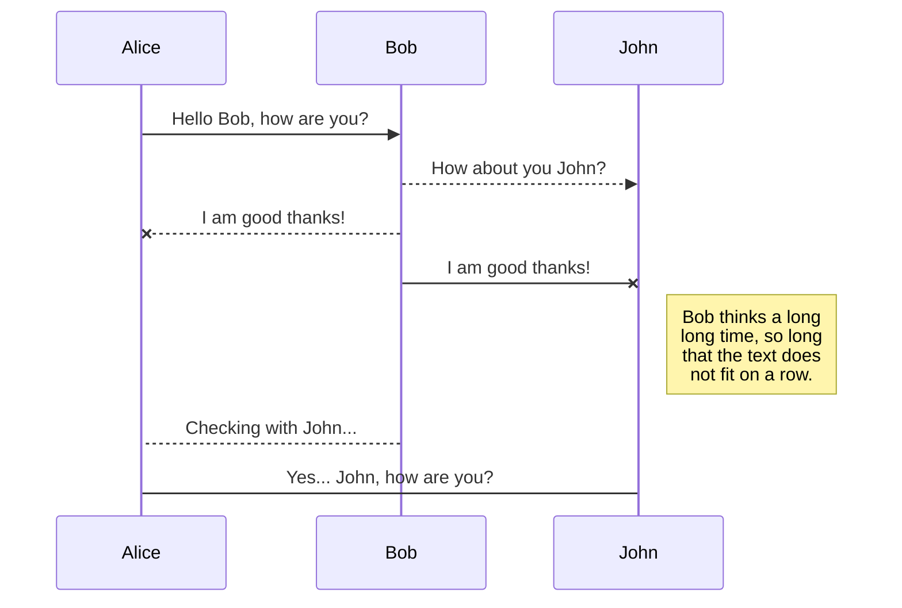
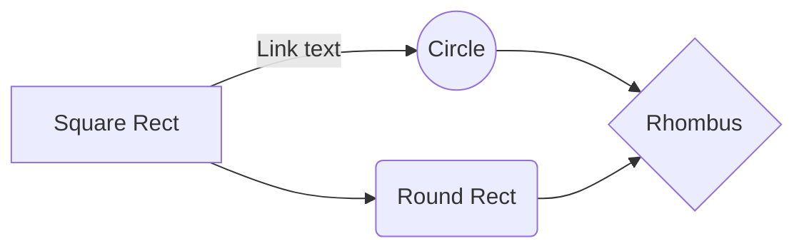
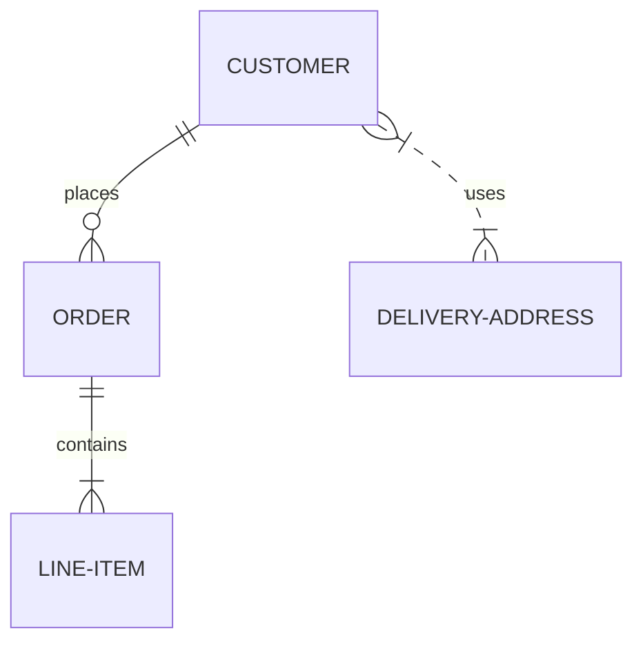

# Template-wed2
### Support Me

<ul style="list-style-type: none; margin: 0;">

<li style="display: inline-block; margin-right: 0.25rem;"><a href="https://www.buymeacoffee.com/xateeeiun0"></a></li>

</ul>

## Run Locally
**Clone the project**

```bash
  git clone [https://github.com/projects-LAB1/Template-wed2.git)
```
**Go to the project directory**

```bash
  cd Template-wed2
```


## UML diagrams


<!--You can render UML diagrams using [Mermaid](https://mermaidjs.github.io/). For example, this will produce a sequence diagram:  -->



And this will produce a flow chart:



And this will produce a flow chart:

